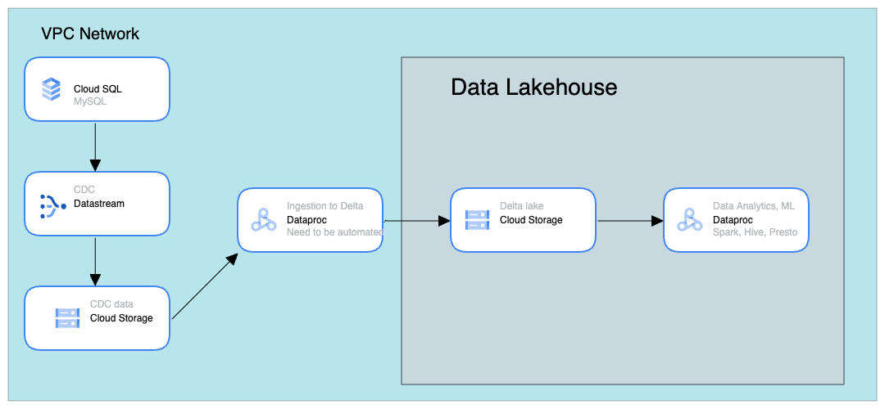

# simple-gcp-lakehouse

## Quickstart:

1. Clone the repo
2. Change directory to simple-gcp-lakehouse/terraform
3. Open variables.tf in code editor and change project name and other variables
4. run `terraform init`
5. run `terraform apply --auto-approve`
6. Upon successfull application the whole infrastructure will be created
7. Add some data:
Because SQL instance doesn't have the public ip you can connect to it via the reverse-proxy machine. Just ssh to reverse proxy. Install msql-client and create a table
You can import data in the cloud SQL UI

